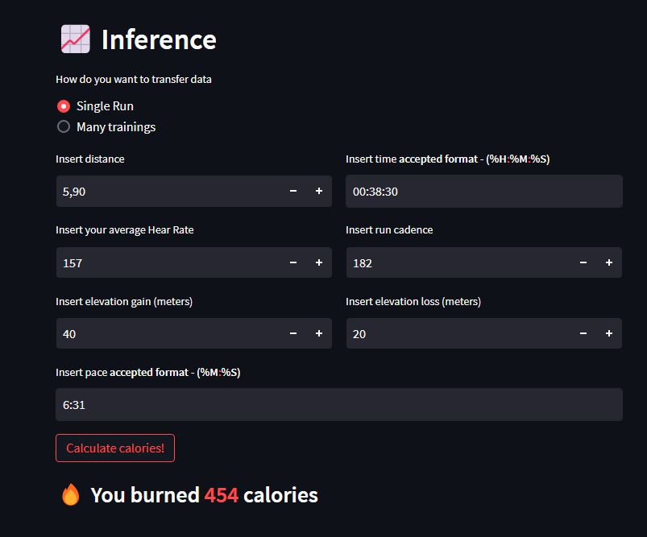
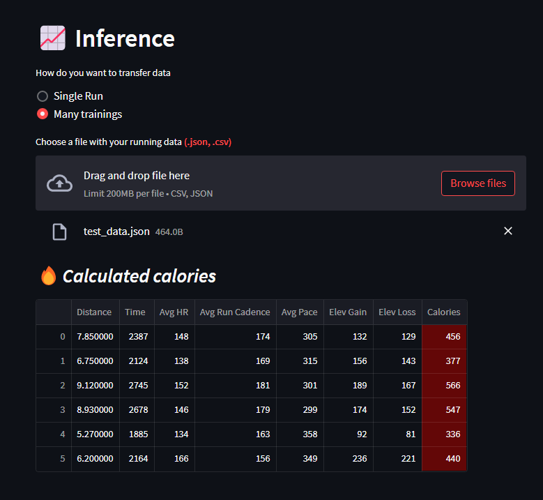

# Running ML project

> This project utilizes the recorded running training data to predict the calories burned during a run.
> Using supervised machine learning algorithm the model estimates calories based on the input features.
> Live demo [_RunSor_](https://frontend-qnzpwdwgvq-lm.a.run.app/).
<hr>

## Table of Contents
* [General Info](#general-information)
* [Technologies Used](#technologies-used)
* [Features](#features)
* [Screenshots](#screenshots)
* [Setup](#setup)
* [Usage](#usage)
* [Project Status](#project-status)
* [Room for Improvement](#room-for-improvement)
* [Contact](#contact)
<!-- * [License](#license) -->

## General Information
This project was designed and created to predict calories burned in running trainings. 
The running training data came from the [kaggle datasets](https://www.kaggle.com/datasets/jeffreybraun/running-log-insight) and was collected via my Garmin GPS watch.
In this project I intend to leverage this data to build and predictive model using **Random Forest Regressor** algorithm 
to estimate the number of calories burned during a run. <br />
This project was created to review my knowledge about the supervised machine learning techniques with software 
engineering to develop, deploy and maintain production ML application.

## Technologies Used
- Python -  3.11
- Scikit-learn - 1.2.2
- Streamlit - 1.22.0
- Numpy - 1.24.3
- Pandas - 2.0.1
- MlFlow - 2.3.2
- Optuna - 3.1.1

## Features
- Predict calories burned during a single run
- Predict calories burned during a series of runs 

## Screenshots 
 <hr>


## Setup

### Virtual environment
```bash
python -m venv venv
venv\Scripts\activate.bat
python -m pip install --upgrade pip setuptools wheel
python -m pip install -e .
```

### API
```bash
uvicorn backend.api:app --host 0.0.0.0 --port 8000 --reload # dev
gunicorn --bind :8000 --workers 1 --threads 8 --timeout 0 -k uvicorn.workers.UvicornWorker backend.api:app  # prod
```

### GOOGLE CLOUD DEPLOYMENT
```bash
gcloud builds submit --tag gcr.io/running-ml-project/backend
gcloud run deploy --image gcr.io/running-ml-project/backend --platform managed --port 8000
```

### Streamlit
```bash
streamlit run --server.port 8050 frontend/app.py
```

## Project Status
Project is: _in progress_.

## Room for Improvement
Room for improvement:
- Communication between frontend app and backend API via Google cloud
- Saving data used to predict calories

## Contact
Created by [@Adrian0](https://github.com/AdrianSzymczyk) - feel free to contact me!
